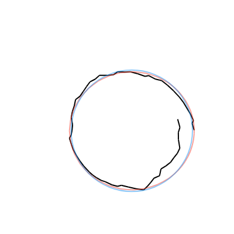
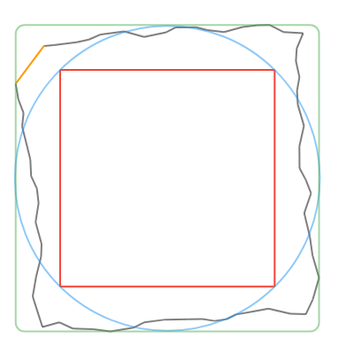
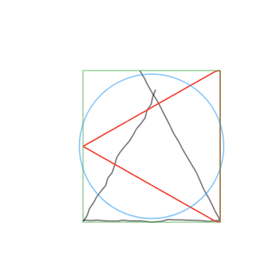

A Dart port of the $1 Unistroke Recognizer, with some additional features planned.

[](https://pub.dev/packages/one_dollar_unistroke_recognizer)

## Usage

#### Basic usage

```dart
List<Offset> points = [...];
RecognizedUnistroke? recognized = recognizeUnistroke(points);
if (recognized == null) {
  print('No match found');
} else {
  print('Stroke recognized as ${recognized.name}');
}
```

#### Protractor enhancement

The Protractor enhancement is enabled by default. You can disable it by setting `useProtractor` to `false`.

```dart
RecognizedUnistroke? recognized = recognizeUnistroke(
  points,
  useProtractor: false,
);
```

#### Getting the "perfect" (canonical) shape

You can get a "perfect" shape from the user's stroke by calling one of the following methods on the `RecognizedUnistroke` object:
- `convertToCanonicalPolygon()`: Returns the closest template match, scaled and translated to match the input gesture. Note that this method returns a list of points, instead of a perfect circle or rectangle like the other methods. Shown in red in the examples below.
- `convertToCircle()`: Returns the radius and center of the best-fit circle. Shown in blue in the examples below.
- `convertToRect()`: Returns the `Rect` of the best-fit (bounding box) rectangle. Shown in green in the examples below.

<!-- Show examples from the test/goldens folder in a table -->
| Circle | Rectangle | Triangle |
| -- | -- | -- |
|  |  |  |

```dart
RecognizedUnistroke? recognized = recognizeUnistroke(points);
switch (recognized?.name) {
  case null:
    break;
  case 'circle':
    final (center, radius) = recognized!.convertToCircle();
    canvas.drawCircle(center, radius, paint);
    break;
  case 'rectangle':
    final rect = recognized!.convertToRect();
    canvas.drawRect(rect, paint);
    break;
  default:
    final polygon = recognized!.convertToCanonicalPolygon();
    canvas.drawPoints(PointMode.polygon, polygon, paint);
    break;
}
```

#### Using custom unistroke templates

You can recognize custom unistrokes by setting the `referenceUnistrokes` list.

Note that this will disable the default unistroke templates defined in `default$1Unistrokes`.

```dart
referenceUnistrokes = [
  Unistroke('circle', [...]),
  Unistroke('rectangle', [...]),
  Unistroke('triangle', [...]),
  Unistroke('leaf', [...]),
];

RecognizedUnistroke? recognized = recognizeUnistroke(points);
```

Alternatively, you can temporarily override the `referenceUnistrokes` list for a single call to `recognizeUnistroke` by setting the `overrideReferenceUnistrokes` list.

```dart
RecognizedUnistroke? recognized = recognizeUnistroke(
  points,
  overrideReferenceUnistrokes: [...],
);
```

You could also set `referenceUnistrokes` to `example$1Unistrokes` to use the templates that were originally defined in the paper, though they're not very pretty and were probably intended to just be a proof-of-concept.

## About the $1 Unistroke Recognizer

The $1 Unistroke Recognizer is a 2-D single-stroke recognizer designed for rapid prototyping of gesture-based user interfaces. In machine learning terms, $1 is an instance-based nearest-neighbor classifier with a 2-D Euclidean distance function, i.e., a geometric template matcher. $1 is a significant extension of the proportional shape matching approach used in SHARK2, which itself is an adaptation of Tappert's elastic matching approach with zero look-ahead. Despite its simplicity, $1 requires very few templates to perform well and is only about 100 lines of code, making it easy to deploy. An optional enhancement called Protractor improves $1's speed. 

You can read more about the $1 Unistroke Recognizer at [depts.washington.edu/acelab/proj/dollar](https://depts.washington.edu/acelab/proj/dollar/index.html).

This Dart package is a port of the JavaScript version of the $1 Unistroke Recognizer, which you can find at [depts.washington.edu/acelab/proj/dollar/dollar.js](https://depts.washington.edu/acelab/proj/dollar/dollar.js).
